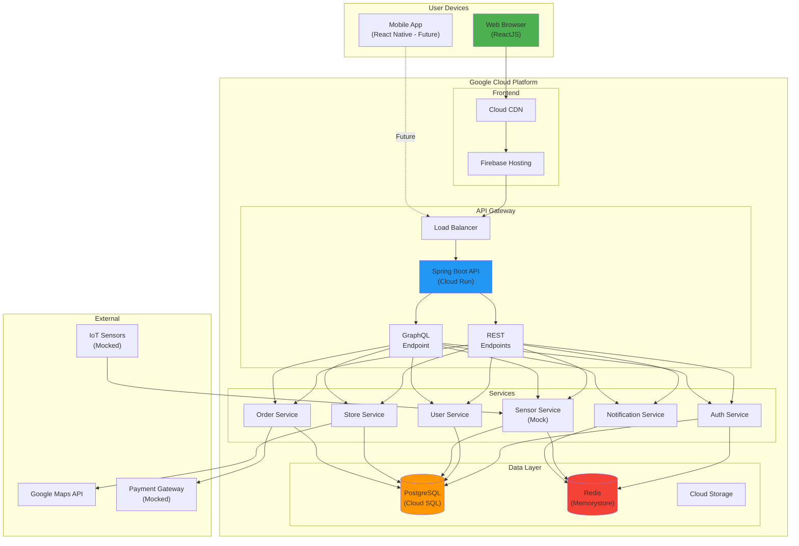
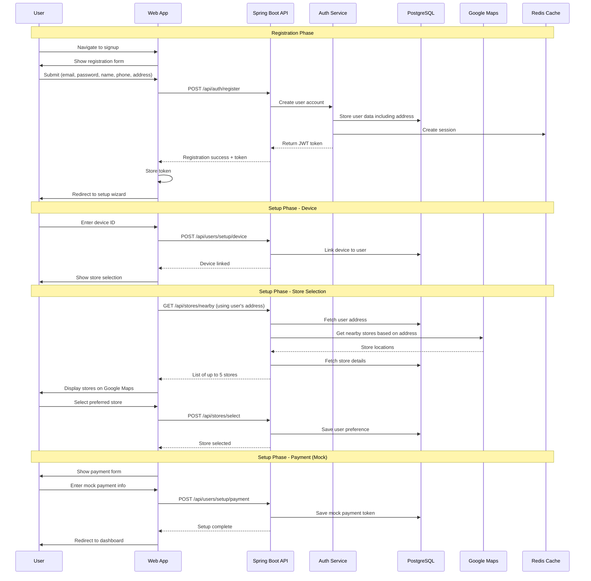
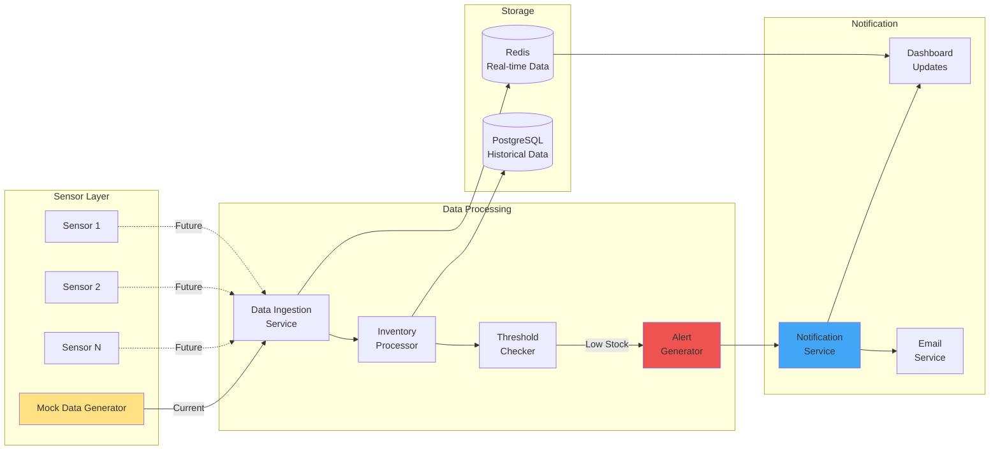
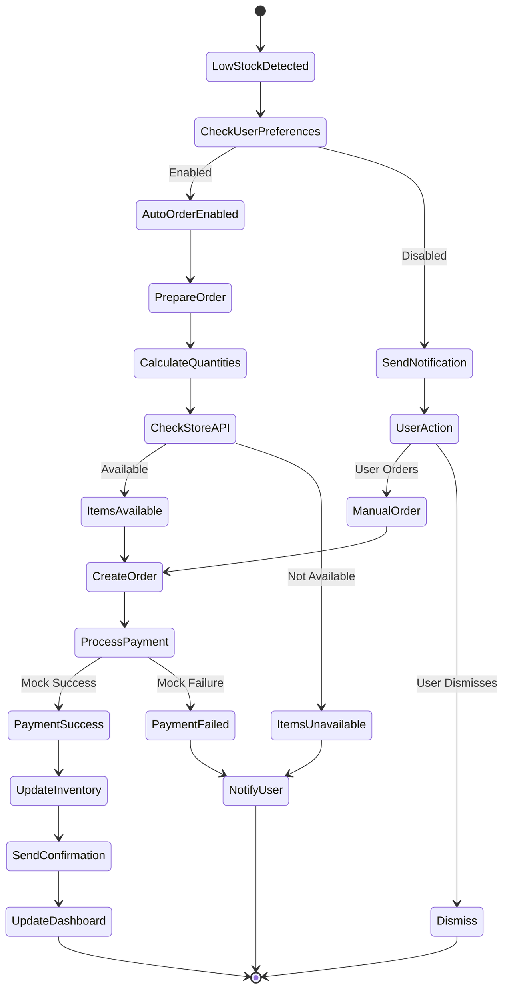
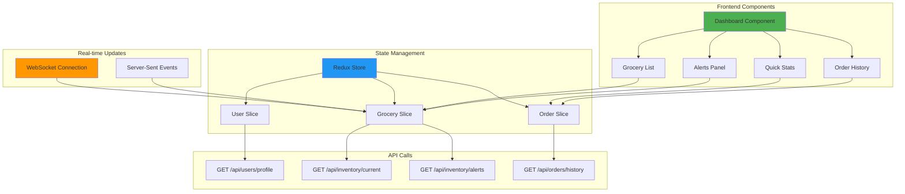
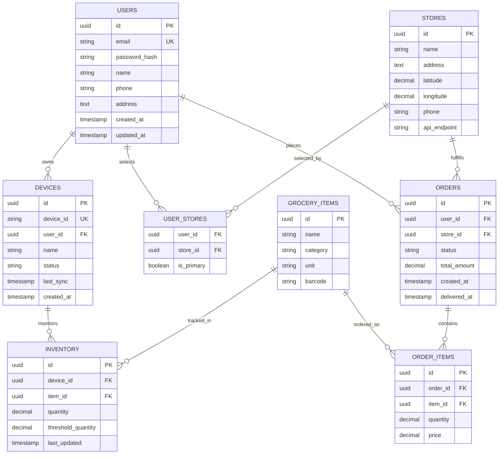
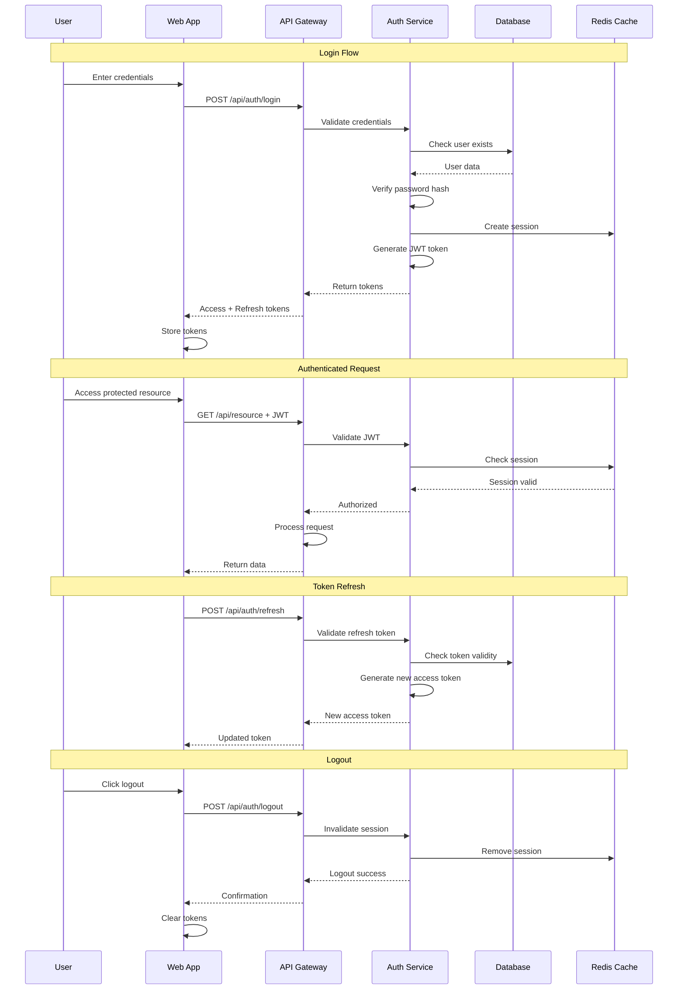
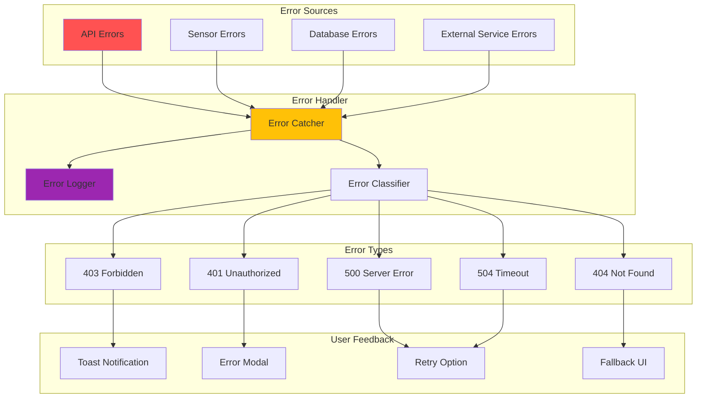
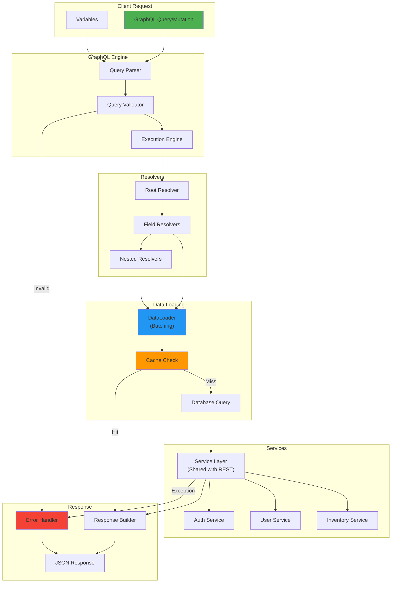
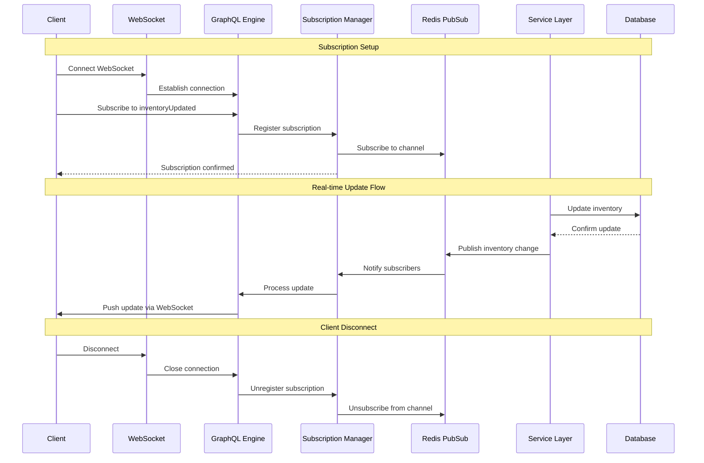

# Grocery Automation POC - Data Flow Diagrams

## Overview
This document contains visual representations of key data flows in the Grocery Automation system using Mermaid diagrams.

## 1. System Architecture Overview

## 2. User Registration and Setup Flow

## 3. Sensor Data Flow and Alert Generation

## 4. Automatic Order Processing Flow

## 5. Dashboard Data Flow

## 6. Database Entity Relationship Diagram

## 7. Authentication Flow

## 8. Error Handling Flow

## 9. GraphQL Resolver Flow

## 10. GraphQL Subscription Flow

## Summary

These diagrams illustrate the key data flows and interactions within the Grocery Automation POC system. They provide a visual understanding of:

1. Overall system architecture and component relationships (including REST and GraphQL APIs)
2. User journey from registration through setup
3. How sensor data flows through the system
4. Automatic order processing logic
5. Dashboard data aggregation and display
6. Database relationships
7. Authentication and authorization flows
8. Error handling strategies
9. GraphQL resolver execution flow with DataLoader optimization
10. GraphQL subscription flow for real-time updates

Each diagram focuses on a specific aspect of the system, making it easier to understand individual components while maintaining awareness of the overall system design. The dual API approach (REST + GraphQL) provides flexibility for different client needs and use cases. 