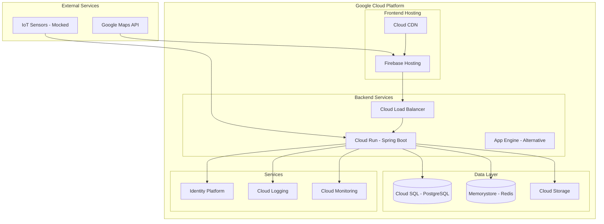

# Grocery Automation POC - High-Level Architecture

## Executive Summary

This document outlines the architecture for a Proof of Concept (POC) application that automates grocery ordering based on refrigerator sensor data. The system monitors grocery levels through IoT sensors and automatically places orders from nearby stores when supplies run low.

## System Overview

The Grocery Automation System consists of:
- **Web Application**: ReactJS-based user interface
- **Backend Services**: Spring Boot REST and GQL API
- **IoT Integration**: Sensor data collection (mocked initially)
- **Store Integration**: Grocery store selection and ordering
- **Cloud Infrastructure**: Google Cloud Platform deployment

## Architecture Components

### 1. Frontend Layer

#### Web Application (ReactJS)
- **Technology**: React 18.x with TypeScript
- **State Management**: Redux Toolkit or Context API
- **Routing**: React Router v6
- **UI Framework**: Material-UI or Ant Design
- **Maps Integration**: Google Maps JavaScript API

**Key Components**:
```
src/
├── components/
│   ├── auth/
│   │   ├── Login.tsx
│   │   ├── Register.tsx
│   │   └── ProfileSetup.tsx
│   ├── dashboard/
│   │   ├── GroceryList.tsx
│   │   ├── AlertsPanel.tsx
│   │   └── QuickStats.tsx
│   ├── setup/
│   │   ├── DeviceSetup.tsx
│   │   ├── StoreSelector.tsx
│   │   └── PaymentSetup.tsx
│   └── orders/
│       ├── OrderHistory.tsx
│       └── OrderDetails.tsx
├── services/
│   ├── api.ts
│   ├── auth.ts
│   └── sensor.ts
└── store/
    ├── userSlice.ts
    ├── grocerySlice.ts
    └── orderSlice.ts
```

### 2. Backend Layer

#### Spring Boot Application
- **Version**: Spring Boot 3.x
- **Java Version**: 17+
- **Build Tool**: Maven or Gradle
- **API Support**: REST + GraphQL

**Architecture Pattern**: Layered Architecture
```
src/main/java/com/groceryautomation/
├── controller/
│   ├── AuthController.java
│   ├── UserController.java
│   ├── SensorController.java
│   ├── StoreController.java
│   └── OrderController.java
├── service/
│   ├── AuthService.java
│   ├── UserService.java
│   ├── SensorService.java
│   ├── StoreService.java
│   ├── OrderService.java
│   └── NotificationService.java
├── repository/
│   ├── UserRepository.java
│   ├── DeviceRepository.java
│   ├── StoreRepository.java
│   └── OrderRepository.java
├── model/
│   ├── User.java
│   ├── Device.java
│   ├── Store.java
│   ├── Order.java
│   ├── OrderItem.java
│   ├── GroceryItem.java
│   ├── Inventory.java
│   ├── UserStore.java
│   └── Notification.java
├── dto/
│   ├── UserDTO.java
│   ├── SensorDataDTO.java
│   └── OrderDTO.java
├── config/
│   ├── SecurityConfig.java
│   ├── CorsConfig.java
│   ├── CacheConfig.java
│   └── GraphQLConfig.java
└── graphql/
    ├── resolver/
    │   ├── QueryResolver.java
    │   ├── MutationResolver.java
    │   └── SubscriptionResolver.java
    ├── dataloader/
    │   └── DataLoaderRegistry.java
    └── scalar/
        └── DateTimeScalar.java
```

### 3. Data Layer

#### Primary Database (PostgreSQL)
**Schema Design**:

```sql
-- Users table
CREATE TABLE users (
    id UUID PRIMARY KEY,
    email VARCHAR(255) UNIQUE NOT NULL,
    password_hash VARCHAR(255) NOT NULL,
    name VARCHAR(255) NOT NULL,
    phone VARCHAR(20),
    address TEXT,
    created_at TIMESTAMP DEFAULT CURRENT_TIMESTAMP,
    updated_at TIMESTAMP DEFAULT CURRENT_TIMESTAMP
);

-- Devices table
CREATE TABLE devices (
    id UUID PRIMARY KEY,
    device_id VARCHAR(255) UNIQUE NOT NULL,
    user_id UUID REFERENCES users(id),
    name VARCHAR(255),
    status VARCHAR(50),
    last_sync TIMESTAMP,
    created_at TIMESTAMP DEFAULT CURRENT_TIMESTAMP
);

-- Stores table
CREATE TABLE stores (
    id UUID PRIMARY KEY,
    name VARCHAR(255) NOT NULL,
    address TEXT,
    latitude DECIMAL(10, 8),
    longitude DECIMAL(11, 8),
    phone VARCHAR(20),
    email VARCHAR(255),
    google_place_id VARCHAR(255) UNIQUE,
    opening_time TIME,
    closing_time TIME,
    active BOOLEAN DEFAULT true,
    accepting_orders BOOLEAN DEFAULT true,
    has_delivery BOOLEAN DEFAULT true,
    has_pickup BOOLEAN DEFAULT true,
    delivery_fee DECIMAL(10, 2),
    minimum_order_amount DECIMAL(10, 2)
);

-- User store preferences with enhanced fields
CREATE TABLE user_stores (
    id UUID PRIMARY KEY,
    user_id UUID REFERENCES users(id),
    store_id UUID REFERENCES stores(id),
    priority INTEGER NOT NULL DEFAULT 1,
    is_primary BOOLEAN DEFAULT false,
    max_delivery_fee DECIMAL(10, 2),
    active BOOLEAN DEFAULT true,
    created_at TIMESTAMP DEFAULT CURRENT_TIMESTAMP,
    UNIQUE(user_id, priority)
);

-- Grocery items master list with SKU
CREATE TABLE grocery_items (
    id UUID PRIMARY KEY,
    name VARCHAR(255) NOT NULL,
    category VARCHAR(100),
    unit VARCHAR(50),
    barcode VARCHAR(255),
    sku VARCHAR(100) UNIQUE,
    brand VARCHAR(255),
    description TEXT,
    default_threshold DECIMAL(10, 2),
    active BOOLEAN DEFAULT true
);

-- Current inventory (from sensor)
CREATE TABLE inventory (
    id UUID PRIMARY KEY,
    device_id UUID REFERENCES devices(id),
    item_id UUID REFERENCES grocery_items(id),
    quantity DECIMAL(10, 2),
    threshold_quantity DECIMAL(10, 2),
    last_updated TIMESTAMP DEFAULT CURRENT_TIMESTAMP
);

-- Orders table with enhanced status tracking
CREATE TABLE orders (
    id UUID PRIMARY KEY,
    order_number VARCHAR(255) UNIQUE NOT NULL,
    user_id UUID REFERENCES users(id),
    store_id UUID REFERENCES stores(id),
    status VARCHAR(50) NOT NULL, -- DRAFT, USER_MODIFIED, SUBMITTED, CONFIRMED, etc.
    subtotal DECIMAL(10, 2),
    delivery_fee DECIMAL(10, 2),
    tax DECIMAL(10, 2),
    total_amount DECIMAL(10, 2),
    estimated_total DECIMAL(10, 2),
    final_total DECIMAL(10, 2),
    draft_created_at TIMESTAMP,
    user_reviewed_at TIMESTAMP,
    submitted_at TIMESTAMP,
    external_order_id VARCHAR(255),
    notification_sent BOOLEAN DEFAULT false,
    delivery_address TEXT,
    delivery_instructions TEXT,
    scheduled_delivery_time TIMESTAMP,
    actual_delivery_time TIMESTAMP,
    payment_method VARCHAR(100),
    tracking_number VARCHAR(255),
    delivery_person_name VARCHAR(255),
    delivery_person_phone VARCHAR(50),
    created_at TIMESTAMP DEFAULT CURRENT_TIMESTAMP,
    updated_at TIMESTAMP DEFAULT CURRENT_TIMESTAMP
);

-- Order items with price tracking
CREATE TABLE order_items (
    id UUID PRIMARY KEY,
    order_id UUID REFERENCES orders(id),
    item_id UUID REFERENCES grocery_items(id),
    quantity DECIMAL(10, 2),
    price DECIMAL(10, 2),
    price_at_creation DECIMAL(10, 2),
    current_price DECIMAL(10, 2),
    user_removed BOOLEAN DEFAULT false,
    price_changed BOOLEAN DEFAULT false,
    quantity_modified BOOLEAN DEFAULT false,
    original_quantity DECIMAL(10, 2),
    subtotal DECIMAL(10, 2),
    notes TEXT
);

-- Notifications table
CREATE TABLE notifications (
    id UUID PRIMARY KEY,
    user_id UUID REFERENCES users(id),
    type VARCHAR(50) NOT NULL,
    title VARCHAR(255),
    message TEXT,
    data JSONB,
    read BOOLEAN DEFAULT false,
    sent_at TIMESTAMP,
    read_at TIMESTAMP,
    created_at TIMESTAMP DEFAULT CURRENT_TIMESTAMP
);
```

#### Cache Layer (Redis)
- Session management
- Real-time sensor data
- Alert states
- API rate limiting

### 4. Integration Layer

#### Mock Services (Initial Phase)
1. **Sensor Data Mock Service**
   - Simulates refrigerator sensor data
   - Returns random grocery levels
   - Triggers low-stock events

2. **Payment Mock Service**
   - Simulates payment processing
   - Always returns success
   - Generates mock transaction IDs

#### External Integrations
1. **Google Maps API**
   - Store location search
   - Distance calculations
   - Map visualization

2. **Future: Real Sensor Integration**
   - MQTT or HTTP protocol
   - Real-time data streaming
   - Device authentication

### 5. Security Architecture

#### Authentication & Authorization
- **Method**: JWT (JSON Web Tokens)
- **Token Storage**: HttpOnly cookies + localStorage
- **Refresh Token**: Stored in database
- **Session Management**: Redis

#### API Security
- CORS configuration
- Rate limiting
- Input validation
- SQL injection prevention
- XSS protection

#### Data Security
- Passwords: BCrypt hashing
- Sensitive data: AES encryption
- HTTPS enforcement
- API key management

## Deployment Architecture (Google Cloud)

### Infrastructure Components



### Deployment Strategy
1. **Frontend**: Firebase Hosting with Cloud CDN
2. **Backend**: Cloud Run (containerized) or App Engine
3. **Database**: Cloud SQL with automated backups
4. **Cache**: Memorystore (managed Redis)
5. **Monitoring**: Cloud Logging and Monitoring

## API Design

The system provides both REST and GraphQL interfaces to accommodate different client needs and use cases.

### RESTful Endpoints

#### Authentication
```
POST   /api/auth/register  # Requires: email, password, name, phone, address
POST   /api/auth/login
POST   /api/auth/logout
POST   /api/auth/refresh
GET    /api/auth/profile
```

#### User Management
```
GET    /api/users/profile
PUT    /api/users/profile
POST   /api/users/setup/device
POST   /api/users/setup/store
POST   /api/users/setup/payment
```

#### Sensor/Inventory
```
GET    /api/inventory/current
POST   /api/inventory/sync
GET    /api/inventory/alerts
PUT    /api/inventory/thresholds
```

#### Store Management
```
GET    /api/stores/nearby?lat={lat}&lng={lng}&radius={radius}
GET    /api/stores/{id}
POST   /api/stores/select                    # Legacy endpoint
POST   /api/stores/user/{userId}/select-store # New endpoint accepting store details from Google Maps
GET    /api/stores/user/{userId}             # Get user's selected stores
```

#### Order Management
```
GET    /api/orders                           # Get all orders
GET    /api/orders/{id}                     # Get specific order details
GET    /api/orders/user/{userId}            # Get user's orders with optional status filter
GET    /api/orders/drafts/user/{userId}     # Get draft orders needing approval
GET    /api/orders/history/user/{userId}    # Get past order history
GET    /api/orders/count/drafts/user/{userId} # Count pending approvals
POST   /api/orders/{orderId}/approve        # Approve draft order
POST   /api/orders/create                   # Legacy create order
PUT    /api/orders/{id}/cancel              # Cancel order
DELETE /api/orders/{id}                     # Delete draft order
```

### API Response Format
```json
{
    "success": true,
    "data": {
        // Response data
    },
    "error": null,
    "timestamp": "2024-01-01T00:00:00Z"
}
```

### GraphQL Interface

#### Overview
The GraphQL API provides a flexible, efficient alternative to REST, particularly beneficial for mobile clients and complex data requirements.

**Endpoint**: `/graphql`
**Playground**: `/graphiql` (development only)
**Subscriptions**: `ws://[host]/graphql-websocket`

#### Technology Stack
- **Spring Boot Starter GraphQL**: Official Spring GraphQL integration
- **GraphQL Java**: Core GraphQL implementation
- **DataLoader**: N+1 query optimization
- **GraphQL Playground**: Interactive API exploration

#### Schema Definition

```graphql
# Root Types
type Query {
    # User queries
    me: User
    user(id: ID!): User
    
    # Inventory queries
    currentInventory(deviceId: ID!): [InventoryItem!]!
    inventoryAlerts: [Alert!]!
    
    # Store queries
    nearbyStores(latitude: Float!, longitude: Float!, radius: Float!): [Store!]!
    store(id: ID!): Store
    
    # Order queries
    orders(status: OrderStatus, limit: Int = 10, offset: Int = 0): OrderConnection!
    order(id: ID!): Order
}

type Mutation {
    # Authentication
    register(input: RegisterInput!): AuthPayload!
    login(email: String!, password: String!): AuthPayload!
    logout: Boolean!
    refreshToken(refreshToken: String!): AuthPayload!
    
    # User management
    updateProfile(input: UpdateProfileInput!): User!
    setupDevice(deviceId: String!): Device!
    selectStore(storeId: ID!): UserStore!
    setupPayment(input: PaymentInput!): PaymentMethod!
    
    # Inventory management
    updateThreshold(itemId: ID!, threshold: Float!): InventoryItem!
    syncInventory(deviceId: ID!): [InventoryItem!]!
    
    # Order management
    createOrder(input: CreateOrderInput!): Order!
    cancelOrder(orderId: ID!): Order!
}

type Subscription {
    # Real-time inventory updates
    inventoryUpdated(deviceId: ID!): InventoryUpdate!
    
    # Alert notifications
    lowStockAlert(userId: ID!): Alert!
    
    # Order status updates
    orderStatusChanged(orderId: ID!): OrderStatusUpdate!
}

# Object Types
type User {
    id: ID!
    email: String!
    name: String!
    phone: String!
    address: String!
    devices: [Device!]!
    selectedStore: Store
    orders(limit: Int = 10, offset: Int = 0): OrderConnection!
    createdAt: DateTime!
    updatedAt: DateTime!
}

type Device {
    id: ID!
    deviceId: String!
    name: String
    status: DeviceStatus!
    lastSync: DateTime
    inventory: [InventoryItem!]!
    user: User!
}

type Store {
    id: ID!
    name: String!
    address: String!
    location: Location!
    phone: String
    distance: Float # Calculated field based on user location
    isOpen: Boolean!
    inventory: [StoreInventoryItem!]!
}

type Location {
    latitude: Float!
    longitude: Float!
}

type InventoryItem {
    id: ID!
    item: GroceryItem!
    quantity: Float!
    threshold: Float!
    status: InventoryStatus!
    lastUpdated: DateTime!
    device: Device!
}

type GroceryItem {
    id: ID!
    name: String!
    category: String!
    unit: String!
    barcode: String
    imageUrl: String
}

type Order {
    id: ID!
    orderNumber: String!
    status: OrderStatus!
    items: [OrderItem!]!
    totalAmount: Float!
    store: Store!
    user: User!
    createdAt: DateTime!
    deliveredAt: DateTime
}

type OrderItem {
    id: ID!
    item: GroceryItem!
    quantity: Float!
    price: Float!
    subtotal: Float!
}

type Alert {
    id: ID!
    type: AlertType!
    message: String!
    severity: AlertSeverity!
    item: GroceryItem
    createdAt: DateTime!
    acknowledged: Boolean!
}

# Enums
enum DeviceStatus {
    ACTIVE
    INACTIVE
    OFFLINE
    ERROR
}

enum InventoryStatus {
    SUFFICIENT
    LOW
    CRITICAL
    OUT_OF_STOCK
}

enum OrderStatus {
    DRAFT
    USER_MODIFIED
    SUBMITTED
    CONFIRMED
    PREPARING
    OUT_FOR_DELIVERY
    DELIVERED
    CANCELLED
    FAILED
}

enum AlertType {
    LOW_STOCK
    OUT_OF_STOCK
    DEVICE_OFFLINE
    ORDER_UPDATE
}

enum AlertSeverity {
    INFO
    WARNING
    CRITICAL
}

# Input Types
input RegisterInput {
    email: String!
    password: String!
    name: String!
    phone: String!
    address: String!
}

input UpdateProfileInput {
    name: String
    phone: String
    address: String
}

input PaymentInput {
    # Mock payment data for POC
    cardNumber: String!
    expiryDate: String!
    cvv: String!
}

input CreateOrderInput {
    storeId: ID!
    items: [OrderItemInput!]!
    deliveryInstructions: String
}

input OrderItemInput {
    itemId: ID!
    quantity: Float!
}

# Pagination
type OrderConnection {
    edges: [OrderEdge!]!
    pageInfo: PageInfo!
    totalCount: Int!
}

type OrderEdge {
    node: Order!
    cursor: String!
}

type PageInfo {
    hasNextPage: Boolean!
    hasPreviousPage: Boolean!
    startCursor: String
    endCursor: String
}

# Response Types
type AuthPayload {
    user: User!
    accessToken: String!
    refreshToken: String!
    expiresIn: Int!
}

type InventoryUpdate {
    device: Device!
    items: [InventoryItem!]!
    timestamp: DateTime!
}

type OrderStatusUpdate {
    order: Order!
    previousStatus: OrderStatus!
    newStatus: OrderStatus!
    timestamp: DateTime!
}

# Custom Scalars
scalar DateTime
```

#### GraphQL Resolvers Architecture

```
src/main/java/com/groceryautomation/graphql/
├── resolver/
│   ├── QueryResolver.java
│   ├── MutationResolver.java
│   ├── SubscriptionResolver.java
│   └── field/
│       ├── UserFieldResolver.java
│       ├── DeviceFieldResolver.java
│       ├── StoreFieldResolver.java
│       └── OrderFieldResolver.java
├── dataloader/
│   ├── UserDataLoader.java
│   ├── DeviceDataLoader.java
│   └── InventoryDataLoader.java
├── input/
│   ├── RegisterInput.java
│   ├── UpdateProfileInput.java
│   └── CreateOrderInput.java
├── type/
│   ├── User.java
│   ├── Device.java
│   ├── Store.java
│   └── Order.java
└── scalar/
    └── DateTimeScalar.java
```

#### Example Queries

**Get User Profile with Devices and Orders:**
```graphql
query GetUserProfile {
    me {
        id
        name
        email
        devices {
            id
            deviceId
            status
            lastSync
            inventory {
                item {
                    name
                    category
                }
                quantity
                threshold
                status
            }
        }
        orders(limit: 5) {
            edges {
                node {
                    id
                    orderNumber
                    status
                    totalAmount
                    createdAt
                }
            }
            totalCount
        }
    }
}
```

**Create Order:**
```graphql
mutation CreateGroceryOrder {
    createOrder(input: {
        storeId: "store-123",
        items: [
            { itemId: "item-1", quantity: 2 },
            { itemId: "item-2", quantity: 1 }
        ],
        deliveryInstructions: "Leave at door"
    }) {
        id
        orderNumber
        status
        items {
            item {
                name
            }
            quantity
            price
        }
        totalAmount
    }
}
```

**Subscribe to Inventory Updates:**
```graphql
subscription WatchInventory {
    inventoryUpdated(deviceId: "device-123") {
        device {
            id
            name
        }
        items {
            item {
                name
            }
            quantity
            status
        }
        timestamp
    }
}
```

#### GraphQL vs REST Decision Matrix

| Use Case | Recommended API | Reason |
|----------|----------------|---------|
| Mobile App | GraphQL | Efficient data fetching, reduced bandwidth |
| Web Dashboard | GraphQL | Complex nested data requirements |
| Third-party Integration | REST | Simpler, standardized interface |
| Webhooks | REST | Standard HTTP callbacks |
| Real-time Updates | GraphQL Subscriptions | Built-in WebSocket support |
| Simple CRUD | REST | Straightforward operations |

#### Security Considerations

1. **Query Depth Limiting**: Prevent deeply nested queries
2. **Query Complexity Analysis**: Limit query complexity scores
3. **Rate Limiting**: Per-query complexity-based limits
4. **Field-Level Authorization**: Restrict sensitive fields
5. **Input Validation**: Strict input type validation

#### Performance Optimizations

1. **DataLoader Pattern**: Batch and cache database queries
2. **Query Caching**: Redis-based query result caching
3. **Pagination**: Mandatory for list queries
4. **Field Resolvers**: Lazy loading for expensive fields
5. **APQ (Automatic Persisted Queries)**: Reduce query payload size

## Data Flow Scenarios

### 1. User Registration & Setup Flow
1. User registers with email, password, name, phone, and address
2. System creates user account with all required information
3. System uses address to determine user location for store selection
4. User adds device ID
5. System validates and links device
6. System shows Google Maps with up to 5 nearby grocery stores based on user's address
7. User selects preferred store
8. User adds payment info (mocked)
9. Setup complete

### 2. Inventory Monitoring Flow
1. Sensor sends data (mocked)
2. Backend processes inventory levels
3. System checks against thresholds
4. Low stock alerts generated
5. Dashboard updates in real-time

### 3. Automatic Ordering Flow
1. System detects low inventory
2. Checks user preferences
3. Creates order with selected store
4. Processes payment (mocked)
5. Sends confirmation to user
6. Updates order history

## Future Enhancements

### Mobile Applications
- **React Native**: Shared codebase with web
- **Features**: Push notifications, barcode scanning
- **Offline Support**: Local data caching

### Advanced Features
1. **Machine Learning**
   - Consumption pattern analysis
   - Predictive ordering
   - Personalized recommendations

2. **Multi-Store Integration**
   - Price comparison
   - Availability checking
   - Delivery scheduling

3. **Smart Home Integration**
   - Alexa/Google Assistant
   - Other IoT devices
   - Home automation systems

## Development Phases

### Phase 1: MVP (Current)
- Basic web application
- User registration and setup
- Mock sensor data
- Mock payment processing
- Simple ordering flow

### Phase 2: Enhanced Features
- Real sensor integration
- Multiple store support
- Advanced alerts
- Order tracking

### Phase 3: Mobile & AI
- React Native apps
- ML-based predictions
- Voice assistants
- Social features

## Technology Decisions Summary

| Component | Technology | Rationale |
|-----------|------------|-----------|
| Frontend | ReactJS | Modern, component-based, large ecosystem |
| Backend | Spring Boot | Enterprise-ready, robust, Java ecosystem |
| API Layer | REST + GraphQL | REST for simplicity, GraphQL for flexibility |
| Database | PostgreSQL | ACID compliance, complex queries, JSON support |
| Cache | Redis | Fast, supports pub/sub for real-time updates |
| Cloud | Google Cloud | Integrated services, good Java support |
| Mobile | React Native | Code reuse, consistent experience |

## Conclusion

This architecture provides a scalable, maintainable foundation for the Grocery Automation POC. The modular design allows for easy extension and the mock services enable rapid development without external dependencies. 